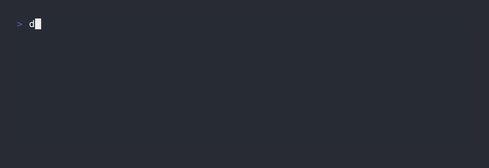

Dockerized script to bulk optimize images using [libvips](https://github.com/libvips/libvips) / [sharp](https://github.com/lovell/sharp) / [bun](https://bun.sh).



## Modes

`overwrite`: Overwrite existing images (default). Scans the directory mounted to `/images`.

```
docker run --rm -v ./images:/images -v ./backup:/backup henrygd/optimize
```

---

`restore`: Restore original images from backup (reverses last `overwrite` operation).

```
docker run --rm -v ./images:/images -v ./backup:/backup -e MODE=restore henrygd/optimize
```

---

`copy`: Write images to different directory. This example converts all images to WEBP.

```
docker run --rm -v ./images:/images -v ./optimized:/optimized -e MODE=copy -e FORMAT=webp henrygd/optimize
```

## Environment Variables

| Name       | Mode | Description                         | Default                             |
| ---------- | ---- | ----------------------------------- | ----------------------------------- |
| EXTENSIONS | \*   | Extensions to optimize[^extensions] | jpg,jpeg,png,webp,tif,tiff          |
| FIT        | \*   | [Fit method](#fit-methods)          | inside                              |
| FORMAT     | copy | Output format[^format]              | unset                               |
| JOBS       | \*   | Number of parallel conversion jobs  | Based on available CPU cores[^jobs] |
| MAX_AGE    | \*   | Age threshold in hours[^age]        | unset                               |
| MAX_HEIGHT | \*   | Max height of output image          | 4000                                |
| MAX_WIDTH  | \*   | Max width of output image           | 4000                                |
| MIN_SIZE   | \*   | Size threshold in kilobytes[^size]  | unset                               |
| MODE       | \*   | [Mode](#modes)                      | overwrite                           |
| OWNER      | \*   | Ownership of new files[^owner]      | root:root                           |
| QUALITY    | \*   | Output quality                      | 80                                  |
| QUIET      | \*   | Log only errors, not every file     | unset                               |

## Fit Methods

- `inside`: Preserving aspect ratio, resize the image to be as large as possible while ensuring its dimensions are less than or equal to both those specified.
- `cover`: Crop to cover both provided dimensions.
- `contain`: Embed within both provided dimensions.
- `fill`: Ignore the aspect ratio of the input and stretch to both provided dimensions.
- `outside`: Preserving aspect ratio, resize the image to be as small as possible while ensuring its dimensions are greater than or equal to both those specified.

[^extensions]: Uppercase versions of extensions are added automatically.
[^size]: Images are only optimized if they are larger than `MIN_SIZE`. For example, `800` would only optimize images larger than 800kB.
[^age]: Images are only optimized if its file content was modififed in the last `MAX_AGE` hours. For example, `24` would only optimize images updated in the last 24 hours.
[^owner]: This applies only to newly created files. Overwritten files should maintain existing permissions. Value should use IDs. For example: `-e OWNER=1000:1000`, or `-e OWNER="$(id -u):$(id -g)"`.
[^format]: This will force all optimized images to be converted to the specified format. Possible values: `webp`, `avif`.
[^jobs]: Default `JOBS` value is one fewer than half of your available cores. If you have 16 cores, it's 7 jobs. If you have 4 cores or fewer, it's only one job.
